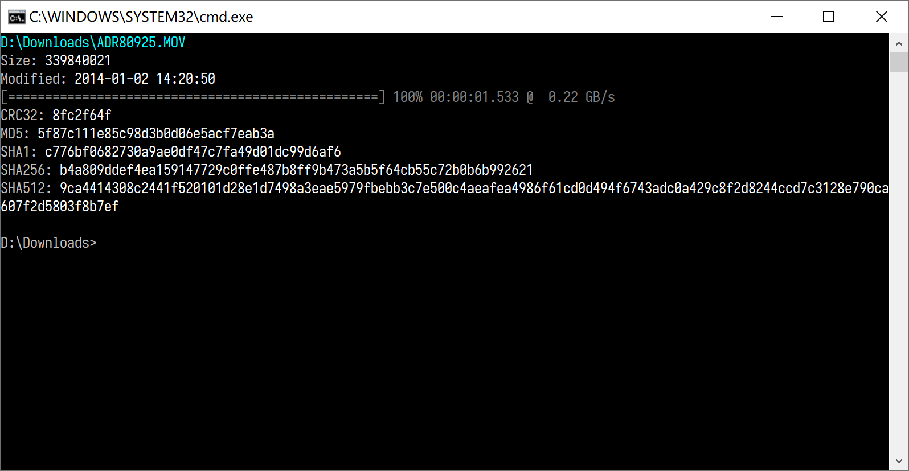

# HashTool

HashTool is a command line tool to compute CRC32, MD5, SHA1, SHA256 and SHA512 hashes of files.

## Build

Following is the content of my `tasks.json` for VSCode(Windows).

```json
{
    "version": "2.0.0",
    "tasks": [{
        "label": "build-icon",
        "type": "shell",
        "command": "windres",
        "options": {
            "cwd": "cmd/hash-tool"
        },
        "args": [
            "-o",
            "hash-tool.syso",
            "hash-tool.rc"
        ]
    }, {
        "label": "build-binary",
        "type": "shell",
        "command": "go",
        "options": {
            "cwd": "cmd/hash-tool"
        },
        "args": [
            "build",
            "-ldflags",
            "-s -w"
        ],
        "dependsOn": ["build-icon"]
    }]
}
```

## Usage

```sh
hash-tool <files>...
```

Examples:

```sh
# compute hashes of file 'a.txt'
hash-tool a.txt

# compute hashes of files 'a.txt' and 'b.mp4'
hash-tool a.txt b.mp4
```

Screenshots:

